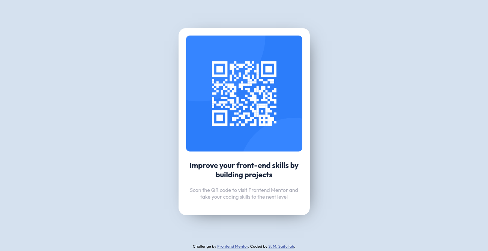

# Frontend Mentor - QR code component solution

This is a solution to the [QR code component challenge on Frontend Mentor](https://www.frontendmentor.io/challenges/qr-code-component-iux_sIO_H). Frontend Mentor challenges help you improve your coding skills by building realistic projects.

## Table of contents

- [Overview](#overview)
  - [Screenshot](#screenshot)
  - [Links](#links)
  - [Built with](#built-with)
  - [Continued development](#continued-development)
  - [Useful resources](#useful-resources)
- [Author](#author)
- [Acknowledgments](#acknowledgments)

**Note: Delete this note and update the table of contents based on what sections you keep.**

## Overview

### Screenshot

### Links

- Solution URL: https://github.com/shaquille19/QR-Code-Component
- Live Site URL: https://shaquille19.github.io/QR-Code-Component

### Built with

- Semantic HTML5 markup
- Flexbox

## Author

- Frontend Mentor - [@shaquille19](https://www.frontendmentor.io/profile/shaquille19)
